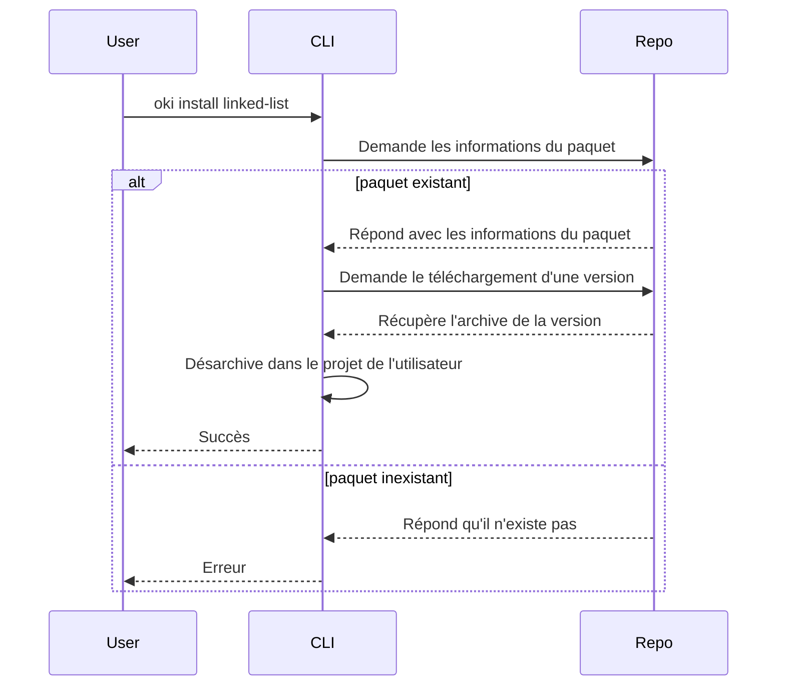

Architecture de la ligne de commande *oki*
==========================================

La commande `oki` constitue le point d'entrée avec le gestionnaire de paquet.
Exécutée dans le répertoire d'un projet, elle permet de gérer les dépendances tout en incluant quelques raccourcis comme la génération d'un *Makefile*.

Composants
----------

Il est bien évidemment question de paquets et de leurs métadonnées. Ils sont modélisés dans `package`.
Ces paquets sont présents dans une collection de dépôts à la fois distants et locaux, dans `repository`.

La configuration de ces dépôts fait partie de `config`, le téléchargement et le désarchivage des paquets dans `io`.

La lecture et la représentation des versions et des contraintes a lieu dans le `semver`. La résolution des dépendances a lieu quant à elle dans `solver`.

Pour terminer, la gestion des commandes de l'utilisateur a lieu dans `cli`.

Compilation
-----------

Le projet nécessite C++ 20 et sa compilation est décrite à l'aide d'un [*Makefile*](Makefile).

Certaines dépendances header-only peuvent être téléchargées à l'aide du script `configurate.sh`, avec l'argument `-d`.

Le script shell `make-in-vdn.sh` peut être utilisé pour compiler dans une machine virtuelle VDN dans le réseau *demo*.

Installation d'un paquet
------------------------

Classes principales
-------------------

Le modèle est constitué de paquets et de leurs versions.
La classe `RemoteRepository` sert de passerelle pour récupérer les informations d'un dépôt distant et instancier le modèle.

Puisque l'on traite des fichiers archivés, des classes sont dédiées à ce rôle. Une pour extraire, une pour archiver, une pour créer un fichier temporaire...

Pour effectuer des requêtes HTTP, *oki* utilise la bibliothèque C `libcurl`.
La classe `HttpRequest` permet de s'abstraire de cette dépendance extérieure et d'utiliser le principe RAII pour implicitement libérer la mémoire grâce au destructeur C++.

Toute requête HTTP peut tout à fait mal se passer, `HttpRequest` est donc susceptible de lever une `RequestException`, abstraites de la `libcurl` et `RemoteRepository` peut ne pas comprendre le JSON que l'API répond, elle lance alors une `APIException`.

L'installateur décrit la procédure d'installation d'un paquet. La plupart du temps, elle dépend d'un type précis (comme `RemoteRepository`).
Il existe des stratégies différentes d'installation comme la copie des paquets dans le projet de l'utilisateur ou le lien avec le cache local via le système de fichiers.

Les versions acceptées par un paquet sont décrites par des contraintes de version. Ces contraintes s'inspirent de la spécification de [gestion sémantique de version](https://semver.org/lang/fr/). Deux versions mineures différentes (par exemple `4.2.0` et `4.5.0`) sont généralement compatibles, tandis que deux versions majeures différentes (comme `1.3.7` et `2.0.0`) peuvent ne pas l'être.
