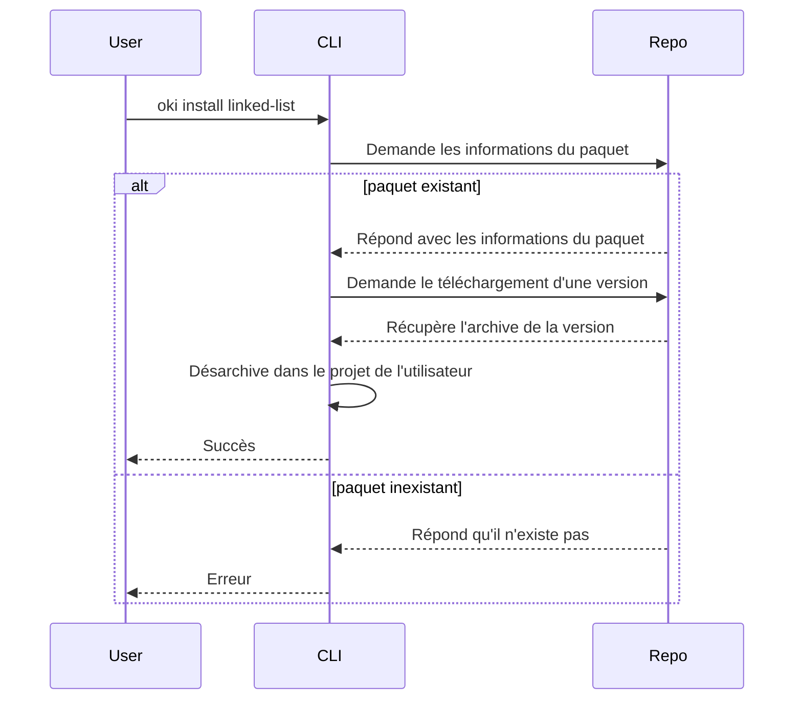
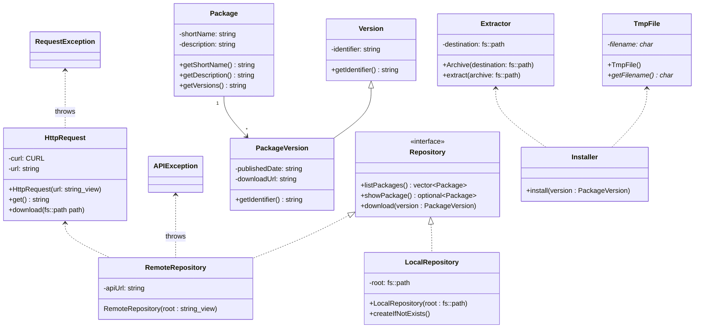
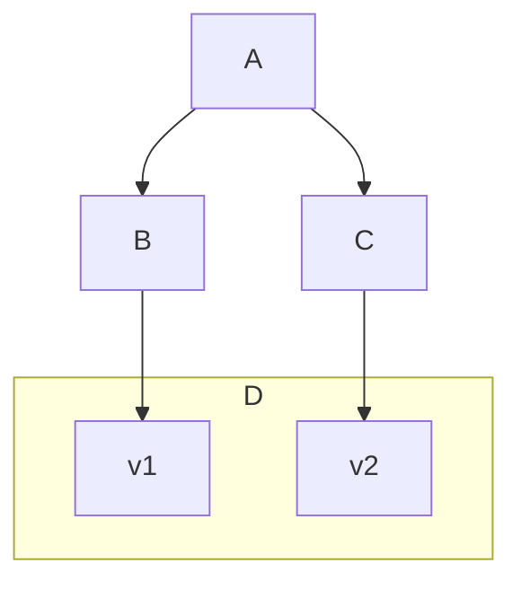
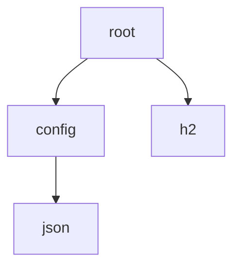

Architecture de la ligne de commande *oki*
==========================================

La commande `oki` constitue le point d'entrée avec le gestionnaire de paquet.
Exécutée dans le répertoire d'un projet, elle permet de gérer les dépendances tout en incluant quelques raccourcis comme la génération d'un *Makefile*.

Composants
----------

Il est bien évidemment question de paquets et de leurs métadonnées. Ils sont modélisés dans `package`.
Ces paquets sont présents dans une collection de dépôts à la fois distants et locaux, dans `repository`.

La configuration de ces dépôts fait partie de `config`, le téléchargement et le désarchivage des paquets dans `io`.

La lecture et la représentation des versions et des contraintes a lieu dans le `semver`. La résolution des dépendances a lieu quant à elle dans `solver`.

Pour terminer, la gestion des commandes de l'utilisateur a lieu dans `cli`.

Compilation
-----------

Le projet nécessite C++ 20 et sa compilation est décrite à l'aide d'un [*Makefile*](Makefile).

Certaines dépendances header-only peuvent être téléchargées à l'aide du script `configurate.sh`, avec l'argument `-d`.

Le script shell `make-in-vdn.sh` peut être utilisé pour compiler dans une machine virtuelle VDN dans le réseau *demo*.

Installation d'un paquet
------------------------



Classes principales
-------------------



Le modèle est constitué de paquets et de leurs versions.
La classe `RemoteRepository` sert de passerelle pour récupérer les informations d'un dépôt distant et instancier le modèle.

Puisque l'on traite des fichiers archivés, des classes sont dédiées à ce rôle. Une pour extraire, une pour archiver, une pour créer un fichier temporaire...

Pour effectuer des requêtes HTTP, *oki* utilise la bibliothèque C `libcurl`.
La classe `HttpRequest` permet de s'abstraire de cette dépendance extérieure et d'utiliser le principe RAII pour implicitement libérer la mémoire grâce au destructeur C++.

Toute requête HTTP peut tout à fait mal se passer, `HttpRequest` est donc susceptible de lever une `RequestException`, abstraites de la `libcurl` et `RemoteRepository` peut ne pas comprendre le JSON que l'API répond, elle lance alors une `APIException`.

L'installateur décrit la procédure d'installation d'un paquet. La plupart du temps, elle dépend d'un type précis (comme `RemoteRepository`).
Il existe des stratégies différentes d'installation comme la copie des paquets dans le projet de l'utilisateur ou le lien avec le cache local via le système de fichiers.

Les versions acceptées par un paquet sont décrites par des contraintes de version. Ces contraintes s'inspirent de la spécification de [gestion sémantique de version](https://semver.org/lang/fr/). Deux versions mineures différentes (par exemple `4.2.0` et `4.5.0`) sont généralement compatibles, tandis que deux versions majeures différentes (comme `1.3.7` et `2.0.0`) peuvent ne pas l'être.

Solveur de version
------------------

La gestion des dépendances demande de sélectionner pour chaque dépendance une version compatible avec tout le reste.

Le problème de sélection de la version d'un paquet consiste à trouver un ensemble de dépendances qui peuvent être utilisées pour construire un paquet de niveau supérieur P qui est complet (toutes les dépendances sont satisfaites) et compatible (aucun paquet incompatible n'est sélectionné).

Il se peut qu'un tel ensemble n'existe pas, à cause du problème de la dépendance en diamant : peut-être que A a besoin de B et C ; B a besoin de D version 1, pas 2 ; et C a besoin de D version 2, pas 1. Dans ce cas, en supposant qu'il n'est pas possible de choisir les deux versions de D, il n'y a aucun moyen de construire A.



Un gestionnaire de paquets a besoin d'un algorithme pour sélectionner les versions des paquets : lorsque vous exécutez `oki install minizip`, l'application peut supposer que vous voulez dire la dernière version de `minizip`, mais elle doit alors trouver un moyen de satisfaire les dépendances transitives de `minizip`, ou bien afficher une explication compréhensible de la raison pour laquelle `minizip` ne peut pas être installé.

Le problème de la sélection de version est NP-complet, ce qui signifie qu'il est peu probable que nous trouvions un algorithme qui s'exécuterait rapidement dans tous les cas.

L'algorithme va devoir essayer potentiellement beaucoup de combinaisons de versions avant d'en trouver une compatible. Dans le meilleur des cas cependant, la solution correspond à choisir la version la plus récente de chaque paquet, et ce récursivement.

L'application `oki` utilise pour résoudre ce problème un [algorithme de retour sur trace](https://fr.wikipedia.org/wiki/Retour_sur_trace) pour parcourir de manière exhaustive toutes les combinaisons possibles.

Supposons les dépendances suivantes :


Chaque paquet peut être résumé sommairement par sa liste de dépendances, par exemple :
```toml
[dependencies]
config = '^13.2.0'
h2 = '^1.21.0'
```

Chaque exigence est interprétée comme une contrainte sur la version à sélectionner du paquet. Cette contrainte demande à ce que chaque version retenue soit comprise dans un intervalle :

> Versions concrètes : `config` ∈ [13.2.0, 14.0.0[ et `h2` ∈ [1.21.0, 2.0.0[

Dans cet algorithme, la solution de ce problème est construite pas à pas. Initialement, la liste des dépendances à satisfaire ne contient que les dépendances connues directement, c'est-à-dire les deux précédemment citées dans notre exemple. La solution courante est quant à elle une liste vide.

Profondeur de récursivité 1 : L'algorithme sélectionne tout d'abord la première contrainte à satisfaire. Il tente tout d'abord la version la plus récente de cette dépendance qui correspond, par exemple `config` = 13.9.2.
Cette version est ajoutée à la solution partielle. Si cette version a des dépendances, elles sont ajoutées dans une copie de la liste des contraintes à satisfaire, de laquelle est retirée la contrainte qui vient d'être résolue.

Profondeur de récursivité 2 : L'algorithme explore récursivement cette solution partielle avec pour premier élément `config = 13.9.2`.
Supposons que `config` demande le paquet `json` ∈ [4.1.0, 5.0.0[ qui n'a pas de dépendance. La version la plus récente de `json` qui satisfasse cette contrainte est `4.6.0`.
Une nouvelle copie de la solution partielle est créée, auquel on ajoute cette version de `json` : `config = 13.9.2, json = 4.6.0`.

Profondeur de récursivité 3 : Une première partie de solution a été trouvée, mais il reste encore à sélectionner une version pour le paquet `h2`.
L'algorithme sélectionne à nouveau la dernière version compatible avec la contrainte de version de ce paquet. La nouvelle solution partielle devient `config = 13.9.2, json = 4.6.0, h2 = 1.21.9`.

Profondeur de récursivité 4 : La liste des contraintes restantes à satisfaire est vide. Puisque nous en sommes arrivés là, nous avons trouvé une solution complète au problème initial : installer les versions trouvées jusqu'ici est possible.
La pile de récursivité est remontée en indiquant que le chemin trouvé dans le graphe des dépendances convient.
