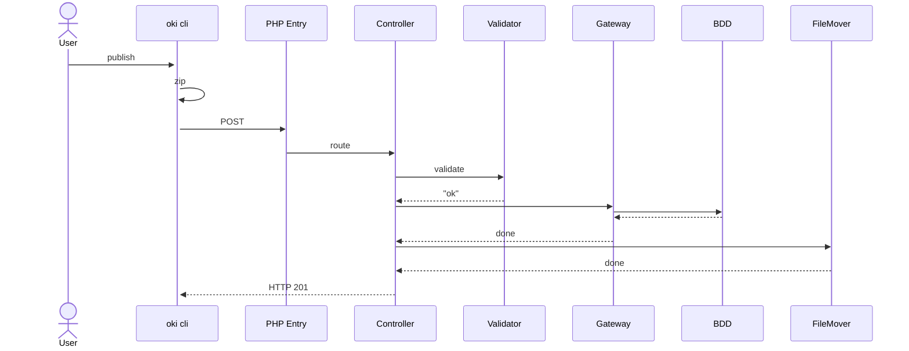

```mermaid
sequenceDiagram
actor User
    User->>+oki cli: publish
    oki cli->> oki cli: zip
    oki cli ->> PHP Entry: POST
    PHP Entry ->> Controller: route
    Controller ->> Validator: validate
    Validator -->> Controller: "ok"
    Controller ->> Gateway: 
    Gateway ->> BDD: 
    BDD -->> Gateway: 
    Gateway -->> Controller: done
    Controller ->> FileMover: 
    FileMover -->> Controller: done
    Controller -->> oki cli: HTTP 201

```